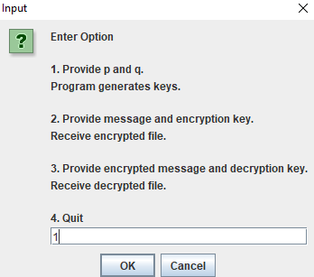

# RSA Text-File Encryption

## Contents

- [**About**](#about)
- [**Menu**](#menu)
- [**Generate Keys**](#generate-keys)
- [**Encrypt Text File**](#encrypt-text-file)
- [**Decrypt Encrypted File**](#decrypt-encrypted-file)

---

## About

The RSA algorithm for encryption draws its strength from the *Fundamental
Theorem Of Arithmetic*, which states that any positive integer either is a
prime number or can be uniquely represented as a product of prime numbers.

In order to *crack* the encryption provided by the RSA algorithm, one must
factor a very large number into its unique prime constituents; a lengthy
process with no straight-forward easy solution. 

### Technologies and Concepts:
	
- Java
- *Euclid's Algorithm* for finding GCD 
- *Chinese Remainder Theorem* for fast modular exponentiation
- Unique properties of prime numbers

---

## Menu

This is a menu-driven application that provides three services which carry out
the ***RSA Cryptography Algorithm ***. The user can choose to:

1. Provide two large prime numbers and have the program generate the encryption
   and decryption keys

2. Provide a text file containing a message to be encrypted and have the
   program carry out encryption
	- User provides public encryption key

3. Provide a text file containing an encrypted message to be decrypted and have
   the program carry out decryption
	- User provides private decryption key

---

## Generate Keys

In this example, the firt prime number provided was **9733**. The second prime number provided was **8081**. Using this information, the program generated the following keys:

| **Encryption Key**                           | **Decryption Key**                          |
|----------------------------------------------|---------------------------------------------|
| encryption exponent = 78652369, n = 78652373 | decryption exponent = 7175089, n = 78652373 |

### Notes
- Due to the complex exponentiation calculations that are performed to carry
  out the algorithm along with the limitations of the *BigInteger* class in
  *Java*, the program will not work for p or q larger than ***9733***. 

- The program assumes that the numbers being provided are, indeed, prime.

---

## Encrypt Text File

Next, the program encrypts a text file which contains the U.S. constitution
using the public encryption keys from ***1***.

---

## Decrypt Encrypted File

The recipient of the message can decrypt it using their private decryption key. 

---
